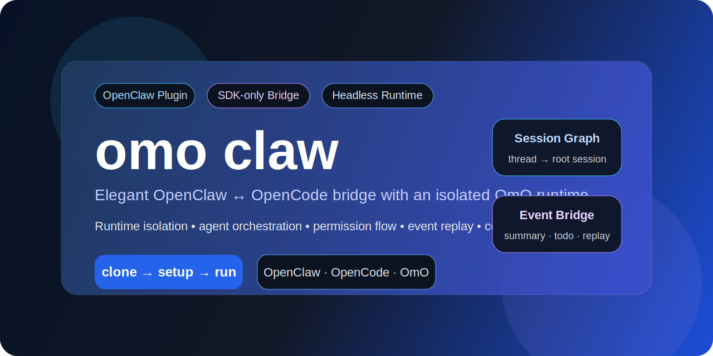
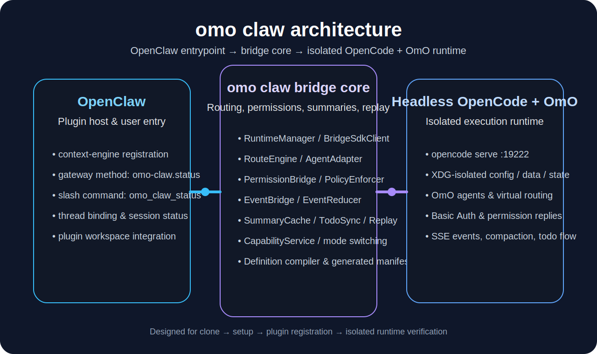

# omo claw

<p align="center">
  
</p>

<p align="center">
  <strong>面向 OpenClaw 的 SDK-only 插件与 context-engine 桥接层，连接 OpenCode + OmO</strong>
</p>

<p align="center">
  <a href="./README.md">English</a> ·
  <a href="./OPERATIONS.md">运维说明</a> ·
  <a href="./CONTRIBUTING.md">贡献指南</a> ·
  <a href="./SECURITY.md">安全策略</a>
</p>

<p align="center">
  
  
  
</p>

`omo claw` 用来把 **OpenClaw 线程**接到一个**隔离的 Headless OpenCode + OmO 运行时**上。它不是简单的 SDK 调用包装，而是把 runtime、route、permission、todo、summary、replay、compatibility 这几层都收拢到一个桥接插件里。

---

## 这个项目解决什么问题

它主要解决这几件事：

- 为 OpenClaw 提供一个真正可落地的插件入口
- 把 thread 稳定映射成 session tree
- 把 `promptAsync`、SSE 事件、todo、permission flow 串成完整闭环
- 让 OpenCode / OmO 升级后不至于直接把桥打断

如果你要的是一个**能跑长任务、能做权限审批、能做状态解释、能做升级适配**的桥接层，这个仓库就是围绕这个目标写的。

---

## 架构概览

<p align="center">
  
</p>

### 核心分层

| 层 | 职责 |
| --- | --- |
| OpenClaw | 插件宿主、context-engine 注册、用户入口、状态查询 |
| omo claw bridge core | RuntimeManager、BridgeSdkClient、RouteEngine、SessionGraph、PermissionBridge、EventReducer、Replay、CompatibilityController |
| Headless OpenCode + OmO | agent 执行、todo 来源、permission 请求、SSE 事件、compaction |

---

## 项目亮点

### Runtime 与执行面
- 独立的 `opencode serve` runtime（端口 `19222`）
- XDG 隔离的 config / data / state
- Basic Auth 保护的 bridge runtime

### 会话与路由
- thread → root session 映射
- 命令优先、agent 回退
- `promptAsync` + SSE 的 message correlation

### 长任务连续性
- 事件归约
- summary cache
- todo mirror
- replay / rebind
- 为 compaction hook 预留 companion plugin 路线

### 兼容与升级
- capability snapshot
- diff classifier
- mode switching（`full` / `compatible` / `safe` / `quarantine`）
- adapter registry

---

## 前置依赖

在使用 `omo claw` 前，请先准备：

- [Bun](https://bun.sh/)
- `opencode` CLI（或 `~/.opencode/bin/opencode` 可用）
- 支持 context-engine 插件的 OpenClaw 环境
- 本地允许启动 `127.0.0.1:19222` 的 headless 服务

> 这个仓库不是 Homebrew 风格的一条命令 GUI 工具，而是一个 OpenClaw 插件项目，外加一个受控的 runtime bridge。

---

## 快速开始

```bash
git clone https://github.com/Her-xanadu/omo-claw.git
cd omo-claw
./scripts/setup-local.sh
./integration/bridge-runtime/bridge-launcher.sh
./tests/live/runtime-health.smoke.sh
```

如果配置正常，最后一条 smoke 命令会返回：

```json
{"healthy": true, "version": "1.2.21"}
```

---

## 安装到 OpenClaw

1. 把这个仓库放进 OpenClaw 的插件工作区。
2. 让 OpenClaw 注册 `openclaw.plugin.json`。
3. 在 context-engine 配置里使用插件 id **`omo-claw`**。
4. 用 `./integration/bridge-runtime/bridge-launcher.sh` 启动 bridge runtime。
5. 用 `./tests/live/runtime-health.smoke.sh` 验证运行时。

OpenClaw 侧关键标识如下：

| 项 | 值 |
| --- | --- |
| 插件 id | `omo-claw` |
| 插件名称 | `omo claw` |
| Gateway 方法 | `omo-claw.status` |
| 状态命令 | `omo_claw_status` |

---

## 本地开发

```bash
./scripts/setup-local.sh
bun test
bun run typecheck
./tests/live/runtime-health.smoke.sh
```

常用附加命令：

```bash
bun run compile:definitions
./scripts/publish-github.sh omo-claw Her-xanadu public
```

---

## 目录结构

| 路径 | 用途 |
| --- | --- |
| `src/` | bridge 主实现 |
| `integration/bridge-runtime/` | 隔离运行时包装、配置、启动器 |
| `definitions/` | 单源定义、编译器、生成产物 |
| `compatibility/` | snapshot、diff classifier、adapter registry |
| `contracts/` | 机器可校验合同 |
| `tests/` | 单测、合同测试、e2e、smoke |
| `docs/assets/` | README 视觉素材 |

---

## 安全说明

- 不要提交 `integration/bridge-runtime/.bridge-secret`
- 运行时状态要保留在被忽略的 `integration/bridge-runtime/xdg/`
- 如果本地元数据变化，发布前请检查 generated artifacts
- 升级后请重新验证 compatibility mode 与 directory filtering

---

## 相关文档

- [English README](./README.md)
- [运维说明](./OPERATIONS.md)
- [发布说明](./PUBLISHING.md)
- [贡献指南](./CONTRIBUTING.md)
- [安全策略](./SECURITY.md)

---

## License

MIT
